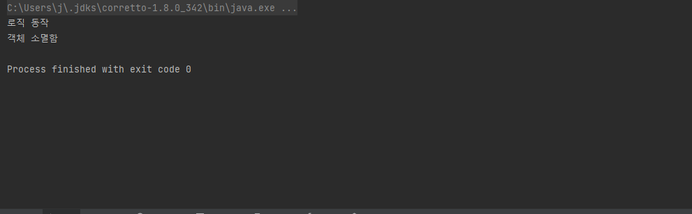

> # JAVA의 객체 소멸자
> > Class는 **생성자**(Constructor)와 **소멸자**(Destructor)라는 특별한 함수가 있다.   
> > 생성자는 익숙한 개념이지만 자바에서 소멸자를 직접 정의하여 사용하는 경우는 드물기 때문에 생소하게 생각될 수 있다.
소멸자(Destructor)는 객체가 소멸될 때 호출되는 함수로 Java에서는 **finalizer**와 **cleaner** 두가지의 객체 소멸자를 제공한다.
> > * ## finalizer 란?
> > Object 클래스는 finalize() 메서드를 제공한다. 가비지 수집기(GC)가 메모리에서 개체를 제거하기 전에 finalize() 메서드를 호출한다. 메서드는 0회 또는 1회 실행될 수 있으며 동일한 개체에 대해 두 번 실행할 수 없다.   
> > * Java 9 버전 부터는 deprecated 되었다.
> > ```
> > @Override
> >	protected void finalize() throws Throwable {
> >		// do something
> >		super.finalize();
> >	}
> > ```
> >
> > * ## cleaner 란?
> > Java9 에서 도입된 소멸자로 생성된 Cleaner 가 더이상 사용되지 않을 때 등록된 스레드에서 정의된 클린 작업을 수행한다.   
> > ```
> > public class CleaningRequiredObject implements AutoCloseable {
> >
> >    private static final Cleaner cleaner = Cleaner.create​();
> >
> >    private static class CleanData implements Runnable {
> >
> >        @Override
> >        public void run() {
> >            // 여기서 클린 작업 수행
> >        }
> >    }
> >
> >    private final CleanData;
> >    private final Cleaner.Cleanable cleanable
> >
> >    public CleaningRequiredObject() {
> >        this.cleanData = new CleanData();
> >
> >        // 등록
> >        this.cleanable = cleaner.register(this, state);
> >    }
> >
> >    @Override
> >    public void close() {
> >        cleanable.clean();
> >    }
> >}
> > ```
> > 
> # finalizer와 cleaner의 사용을 피해야 하는 이유
> > ## 1. 동작 시점을 예측할 수 없다.
> > **finalizer**와 **clenaer**는 **jvm**이 **gc**작업을 수행할 때 동작하기 때문에 정확한 동작 시점을 알수 없다.   
> 예를 들어 리소스를 반납하는 작업(파일 입출력 , DB 접근 등)을 해당 메소드에서 처리한다면 자원이 언제 해제될지 알수 없고,
> 자원 반납이 되지 않아 해당 자원에 대한 접근이 불가능 해지는 상황이 발생할 수 있다.
> > * **System.gc** 나 **System.runFinalization** 메서드가 **finalizer와** **cleaner**가 실행될 가능성을 높여줄 순 있으나 보장하지 않는다.
> > ## 2. 심각한 성능 문제를 동반한다
> > **AutoCloseable** 객체를 만들고, **try-with-resource**로 자원 반납을 하는데 걸리는 시간은 12ns 인데 반해, **finalizer**를 사용한 경우에 550ns, 약 50배가 걸렸다. Cleaner를 사용한 경우에는 66ns가 걸렸다 약 5배.
> > ## 3. finalizer를 사용한 클래스는 심각한 보안 문제를 일으킬 수 있다.
> > 생성이나 직렬화 과정에서 에외가 발생하면 생성되다 만 객체에서 악의적인 하위 클래스의 finalizer가 수행될 수 있게 된다.
> > ```
> > public class KakaoBank {
> >
> >    private int money;
> >
> >    public KakaoBank(final int money) {
> >        if (money < 1000) {
> >            throw new RuntimeException("1000원 이하로 생성이 불가능해요.");
> >        }
> >        this.money = money;
> >    }
> >
> >    void transfer(final int money) {
> >        this.money -= money;
> >        System.out.println(MessageFormat.format("{0}원 입금 완료!!", money));
> >    }
> > }
> > ```
> > ```
> > public class BankAttack extends KakaoBank {
> >
> >    public BankAttack(final int money) {
> >        super(money);
> >    }
> >
> >    @Override
> >    protected void finalize() throws Throwable {
> >        this.transfer(1000000000);
> >    }
> > }
> > ```
> > ```
> > public class Main {
> >    public static void main(final String[] args) throws InterruptedException {
> >        KakaoBank bank = null;
> >        try {
> >            bank = new BankAttack(500);
> >            bank.transfer(1000);
> >        } catch (Exception e) {
> >            System.out.println("예외 터짐");
> >        }
> >        System.gc();
> >        sleep(3000);
> >    }
> > }
> > ```
> > </img><br/>
> > finalizer 공격을 방지하기 위한 방법중 하나는 부모 클래스에서 finalize()를 overried하여 final 클래스로 설정하여 상속받는 클래스에서 finalize()를 override를 불가능 하게 하는 방법이 있다.
> > ```
> > public class KakaoBank {
> >
> >    private int money;
> >
> >    public KakaoBank(final int money) {
> >        if (money < 1000) {
> >            throw new RuntimeException("1000원 이하로 생성이 불가능해요.");
> >        }
> >        this.money = money;
> >    }
> >
> >    void transfer(final int money) {
> >        this.money -= money;
> >        System.out.println(MessageFormat.format("{0}원 입금 완료!!", money));
> >    }
> > 
> >    @Override
> >    protected final void finalize() throws Throwable {
> >        super.finalize();
> >    }
> > }
> > ```
> # finalizer와 cleaner의 대안
> > **AutoCloseable**을 구현하고 클라이언트에서 인스턴스를 다 쓰고나면 close 메서드를 호출하면 된다. try-finally나 try-with-resourse를 사용하여 자원을 종료시킬 수 있다.
> > ```
> > public class KakaoBank implements AutoCloseable{
> >
> >   private int money;
> >
> >   public KakaoBank(final int money) {
> >      if (money < 1000) {
> >          throw new RuntimeException("1000원 이하로 생성이 불가능해요.");
> >      }
> >      this.money = money;
> >  }
> >
> >   void transfer(final int money) {
> >       this.money -= money;
> >       System.out.println(MessageFormat.format("{0}원 입금 완료!!", money));
> >   }
> >
> >   @Override
> >   public void close() throws Exception {
> >       System.out.println("객체 소멸함");
> >   }
> > }
> >```
> > ```
> > public class Main {
> >    public static void main(String[] args) {
> >        try (KakaoBank kakaoBank = new KakaoBank(11000)) {
> >            System.out.println("로직 동작");
> >        } catch (Exception e) {
> >            throw new RuntimeException(e);
> >        }
> >    }
> > }
> > ```
> > </img><br/>
> # finalize와 cleaner를 사용하는 경우
> > ## 1. 자원의 소유자가 close 메서드를 호출하지 않는 것에 대비
> > **cleaner**, **finalizer**가 즉시 호출될것이란 보장은 없지만, 클라이언트가 하지 않은 자원 회수를 늦게라도 해주는 것이 아예 안하는 것보다 낫다. 하지만 이런 안전망 역할로 **finalizer**를 작성할 때 그만한 값어치가 있는지 신중히 고려해야 한다. 자바에서는 안전망 역할의 **finalizer**를 제공한다. **FileInputStream**, **FileOutputStream**, **ThreadPoolExecutor**가 대표적이다.
> > ## 2. 네이티브 자원 정리
> > **cleaner**와 **finalizer**를 적절히 활용하는 두 번째 예는 **네이티브 피어**와 연결된 객체이다. **네이티브 피어**란 일반 자바 객체가 네이티브 메서드를 통해 기능을 위임한 네이티브 객체를 말한다. 그 결과 자바 피어를 회수할 때 네이티브 객체까지 회수하지 못 한다. 성능 저하를 감당할 수 없거나 자원을 즉시 회수해야 한다면 close 메서드를 사용해야 한다.
> > * **네이티브 메서드**란 java언어가 아닌 C나 C++ 같은 네이티브 프로그래밍 언어로 작성한 메소드를 말하며 특정한 상황에서 사용한다. (레지스트리 , 네이티브 라이브러리 , 성능개선 등) 과거에는 jvm 기능이 떨어지는 관계로 사용 하였지만 최근에는 거의 사용되지 않는 추세이다.
> > ```
> > public class Room implements AutoCloseable {
> >    private static final Cleaner cleaner = Cleaner.create();
> >
> >    // Room을 참조하지 말것!!! 순환 참조
> >    private static class State implements Runnable { 
> >        int numJunkPiles;
> >
> >        State(int numJunkPiles) {
> >            this.numJunkPiles = numJunkPiles;
> >        }
> >
> >        @Override
> >        public void run() {  // **colse가 호출되거나, GC가 Room을 수거해갈 때 run() 호출**
> >            System.out.println("Room Clean");
> >            numJunkPiles = 0;
> >        }
> >    }
> >
> >    private final State state;
> >    private final Cleaner.Cleanable cleanable;
> >
> >    public Room(int numJunkPiles) {
> >        state = new State(numJunkPiles);
> >        cleanable = cleaner.register(this, state);
> >    }
> >
> >    @Override
> >    public void close() {
> >        cleanable.clean();
> >    }
> > }
> > ```
> > State 인스턴스가 Room 인스턴스를 참조할 경우 순환참조가 발생하고 가비지 컬렉터가 Room을 회수해갈 기회가 오지 않는다. State가 static인 이유도 바깥 객체를 참조하지 않기 위해서이다.
> > 위 코드는 안전망을 만들었을 뿐이다. 클라이언트가 try-with-resources 블록으로 감쌌다면 방 청소를 정상적으로 출력한다.