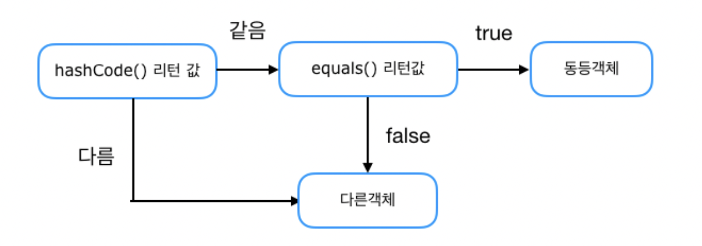

# 아이템11 - equals를 재정의하려거든 hashcode도 재정의하라

`equals`를 재정의한 클래스는 `hashcode`도 재정의 해야한다.
그 이유는 논리적으로 같은 객체는 같은 해시코드를 반환해야하기 때문이다.

그렇지 않으면 인스턴스를 `HashMap`이나 `HashSet` 같은 Hash 컬렉션의 원소로 사용할 때 문제가 발생한다.

## equals만 재정의한 경우
```java
public class Car {
  private final String name;

  public Car(String name) {
    this.name = name;
  }

  @Override
  public boolean equals(Object o) {
    if (this == o) return true;
    if (o == null || getClass() != o.getClass()) return false;
    Car car = (Car) o;
    return Objects.equals(name, car.name);
  }
}

class CarTest {
  public static void main(String[] args) {
    Car carA = new Car("페라리");
    Car carB = new Car("페라리");
    System.out.println(carA.equals(carB)); // true


    List<Car> carList = new ArrayList<>(); // 중복 가능!!!!!
    carList.add(new Car("페라리"));
    carList.add(new Car("페라리"));
    System.out.println(carList.size()); // 2

    Set<Car> carSet = new HashSet<>(); //중복 불가능 !!!!!!
    carSet.add(new Car("페라리"));
    carSet.add(new Car("페라리"));
    System.out.println(carSet.size()); //2 (문제 발생!!!!!!)
  }
}
```
 - `equals`만 재정의한 경우 두 객체는 논리적으로 같은 객체로 판단되며 equals는 true의 결과 값을 갖게 된다. 당연히 `List` 타입의 컬렉션에 두 객체를 넣으면 정상 동작한다.
 - `Set`타입의 중복되지 않는 객체를 넣을 때 문제가 발생한다. 1이 나올거라 예상했지만 결과는 2가 나온다. 그 이유는 `hash` 값을 사용하는 컬렉션을 사용할 때 문제가 발생하기 때문이다.

## hash Collection 동작 과정


 - 컬렉션의 `HashMap`, `HashSet`, `HashTable`은 객체가 논리적으로 같은지 비교할 대 다음과 같은 과정을 거친다.

```java
System.out.println(carA.hashCode()); // 2109957412
System.out.println(carB.hashCode()); // 901506536
```
 - 두 객체의 Object 클래스의 hashCode를 출력해보면 다른 값이 나온더. 즉 hashCode가 다르기 때문에 equals 비교를 하기도 전에 다른 객체로 판단된다.

## hashCode도 같이 재정의한 경우
```java
@Override
public int hashCode() {
  // return Objects.hash(name); JAVA 7
  return name.hashCode();
}

System.out.println(carA.hashCode()); // 109208323
System.out.println(carB.hashCode()); // 109208323

Set<Car> carSet = new HashSet<>();
carSet.add(new Car("sasca"));
carSet.add(new Car("sasca"));
System.out.println(carSet.size()); // 1 정상 동작
```
 - `hashCode`를 재정의 해줌으로 같은 해시 코드 값을 반환하게 되었다. 따라서 해시 컬렉션에서 equals를 비교할 수 있게 되고 동등 객체(equals)로 판단된다.

## HashCode 구현
 - 인텔리제이로 직접 만들기 : 인텔리제이 같은 IDE를이용해 직접 hasHCode를 구현한다.
 - Lombok : Lombok의 `@EqualsAndHashCode`를 통해 편리한 해싱을 적용할 수 있다.
 - record : java 16 이상의 버전을 쓰면 `record`를 사용할 수 있는데 `getter`,`equals`,`hashcode` 등 여러가지 메소드들을 만들어 준다.