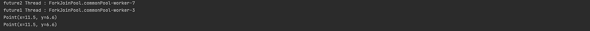

# 변경 가능성을 최소화하라

### 불변 class ? 
> 인스턴스의 내부 값을 수정할 수 없는 클래스  

인스턴스 정보는 객체가 파괴되는 순간까지 절대 달라지지 않음.  
>String, 기본 타입의 박싱 클래스, BigInteger, BigDecimal ..
> 

위 클래스들은 가변 클래스에 비해 설계및 구현의 용이하며, 오류가 생길 여지가 작아 안전한 특성이 있다.
```java
public class Point {

    public double x;
    public double y;
}

public class EffectiveJavaApplication {

    public static void main(String[] args) throws Exception {
        Point point = new Point(1.5, 6.6);

        CompletableFuture<Void> future1 = CompletableFuture.runAsync(() -> {
            System.out.println("future1 Thread : " + Thread.currentThread().getName());
            System.out.println(point);
        });

        CompletableFuture<Void> future2 = CompletableFuture.runAsync(() -> {
            System.out.println("future2 Thread : " + Thread.currentThread().getName());
            point.x += 10;
            System.out.println(point);
        });

        CompletableFuture<Void> allOf = CompletableFuture.allOf(future1, future2);
        allOf.get();
    }
}
```



```java
public class ImmutablePoint {

    private final double x;
    private final double y;

    private ImmutablePoint(double x, double y) {
        this.x = x;
        this.y = y;
    }

    public static ImmutablePoint move(double x, double y) {
        return new ImmutablePoint(x, y);
    }
}
public class EffectiveJavaApplication {

    public static void main(String[] args) throws Exception {
        ImmutablePoint immutablePoint = ImmutablePoint.move(1, 2);

        CompletableFuture future1 = CompletableFuture.runAsync(() -> {
            System.out.println("future1 Thread : " + Thread.currentThread().getName());
            System.out.println("future1 immutablePoint : " + immutablePoint);
        });

        CompletableFuture future2 = CompletableFuture.runAsync(() -> {
            System.out.println("future2 Thread : " + Thread.currentThread().getName());
            System.out.println("future2 immutablePoint : " + immutablePoint.move(11, 12));
        });

        CompletableFuture<Void> allOf = CompletableFuture.allOf(future1, future2);
        allOf.get();
    }
}
```


### 불변 클래스를 만드는 5가지 규칙
- 객체 상태 변경 메서드를 제공하지 않는다.
- 클래스 확장기능을 금지한다.
- 모든 필드를 final로 선언한다.
- 모든 필드를 private으로 선언한다.
  - 이유
- 자신 외에는 내부의 가변 컴포넌트에 접근할 수 없도록 해야 한다.
  - 절대 클라이언트가 제공한 객체 참조를 가리키게해선 안되며, 접근자 메서드가 그 필드를 그대로 반환하는것도 안됨.

***
## 불변 클래스의 장점
- 단순함. 생성 시점부터 파괴전까지 값을 그대로 유지하기때문에 해당 클래스를 사용하는 곳에서 불변성을 보장받을 수 있다.
- 스레드에 안전하며 따로 동기화할 필요가 없다.
  - 쓰기를 지원하지않기때문에 훼손되지 않음.(상태 변경이 불가능함)
- 자유롭게 공유할 수 있기때문에, 방어적 복사(clone)이 불필요하다
  - 방어적 복사 ? 객체의 복사본을 만들어서 반환(원본 내부 객체에 반영 되지않음)
- 실패 원자성을 제공한다.
  - 실패 원자성 ? 메서드에서 예외가 발생한 후에도 그 객체는 여전히 호출전과 똑같은 상태를 가짐.
***
## 불변 클래스의 단점
- 값이 다를 경우 반드시 독립적인 객체를 만들어야한다.
> String 의 경우 불변 클래스로 한번 정의한 값을 그대로 가며
> 값이 변경되면 새로운 객체로 탄생함
> 이럴때 가변 동반 클래스라고하는 StringBuilder 를 사용할 수 있다.  
> 
***
## 불변 클래스를 만드는 방법
- 모든 필드를 final로 선언
- 모든 생성자를 private or public 정적 팩토리 메소드 제공
  - 정적 팩토리 방식은 다수의 구현 클래스르 활용한 유연성을 제공합니다.
- 객체 캐싱 기능을 사용해 성능을 끌어올릴 수 있다.
  - 새로운 객체를 만들지 않고 기존 객체를 반환하기 때문.
***
## 정리
- 클래스는 꼭 필요한 경우가 아니라면 불변이어야 한다.(장점>>>단점:잠재적 성능 저하)
- 모든 클래스를 불변으로 만들 수 없기에 변경할 수 있는 부분은 최소한으로 설정하자.
- 합당한 이유가 없다면 모든 필드는 private final 로 정의 하자
- 생성자는 불변식 설정이 모두 완료된, 초기화가 완벽히 끝난 상태의 객체를 생성해야한다.