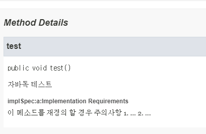

# 상속을 고려해 설계하고 문서화하라. 그러지 않았다면 상속을 금지하라

## 왜 상속을 고려해서 설계하고 문서화 해야할까?

상속을 생각하지 않고 설계한 클래스는 상속하게 될 경우 예기치 못한 문제를 일으킬 수 있다.   
무분별한 재정의를 통한 잘못된 동작이 대표적인 예이다.   
그렇기 떄문에 상속을 고려한다면 처음부터 잘 설계하고 가능하다면 문서화까지 진행하는것이 좋다.   

* 상속용 클래스는 재정의할 수 있는 메서드들을 내부적으로 어떻게 이용하는지 문서로 남겨놓는것이 좋다.

## @ImplSpec 어노테이션을 통한 문서화

@implSpec 태그는 해당 메서드를 하위 클래스들이 상속하거나 super 키워드를 이용해 호출할 때 그 메서드가 어떻게 동작하는지를 명확히 인지하고 사용하도록 하는게 목적이다.

* 자바 8 이상부터 사용 가능하다.
* 자바독 명령줄에서 -tag "implSpec:a:Implementation Requirements" 옵션을 입력해주지 않으면 @implSpec 태그를 찾을수 없다는 에러가 발생한다.

```java
/**
 * 자바독 테스트
 *
 * @implSpec 이 메소드를 재정의 할 경우 주의사항
 * 1. ...
 * 2. ...
 */
public void test() {
    System.out.println("test");
}
```



## 설계시 훅(hook)을 잘 선별하자

훅이란 클래스의 내부 동작 과정 중간에 끼어들 수 있는 코드로 효율적인 하위클래스를 만드는데 도움을 준다.
아래 예시 코드는 AbstractList의 clear() 메소드이며 removeRange() 메소드를 hook으로 사용하였다.

```java
public abstract class AbstractList<E> extends AbstractCollection<E> implements List<E> {
    /**
     * Removes all of the elements from this list (optional operation).
     * The list will be empty after this call returns.
     *
     * @implSpec
     * This implementation calls {@code removeRange(0, size())}.
     *
     * <p>Note that this implementation throws an
     * {@code UnsupportedOperationException} unless {@code remove(int
     * index)} or {@code removeRange(int fromIndex, int toIndex)} is
     * overridden.
     *
     * @throws UnsupportedOperationException if the {@code clear} operation
     *         is not supported by this list
     */
    public void clear() {
        removeRange(0, size());
    }

    /**
     * Removes from this list all of the elements whose index is between
     * {@code fromIndex}, inclusive, and {@code toIndex}, exclusive.
     * Shifts any succeeding elements to the left (reduces their index).
     * This call shortens the list by {@code (toIndex - fromIndex)} elements.
     * (If {@code toIndex==fromIndex}, this operation has no effect.)
     *
     * <p>This method is called by the {@code clear} operation on this list
     * and its subLists.  Overriding this method to take advantage of
     * the internals of the list implementation can <i>substantially</i>
     * improve the performance of the {@code clear} operation on this list
     * and its subLists.
     *
     * @implSpec
     * This implementation gets a list iterator positioned before
     * {@code fromIndex}, and repeatedly calls {@code ListIterator.next}
     * followed by {@code ListIterator.remove} until the entire range has
     * been removed.  <b>Note: if {@code ListIterator.remove} requires linear
     * time, this implementation requires quadratic time.</b>
     *
     * @param fromIndex index of first element to be removed
     * @param toIndex index after last element to be removed
     */
    protected void removeRange(int fromIndex, int toIndex) {
        ListIterator<E> it = listIterator(fromIndex);
        for (int i = 0, n = toIndex - fromIndex; i < n; i++) {
            it.next();
            it.remove();
        }
    }

}
```

* removeRange()
    * clear()를 고성능으로 만들기 쉽게 하기 위해 제공
    * 해당 메서드가 없었다면 하위 클래스에서 clear 메서드 호출 시 성능이 느려지거나 새로 구현해야 함

## 상속용 클래스의 테스트

상속용 클래스를 시험하는 방법은 직접 하위 클래스를 만들어보는 것이 유일하며 배포전 반드시 검증해야 한다.

## 상속용 클래스의 생성자에서 재정의 가능한 메서드 호출 금지

상위 클래스의 생성자는 하위 클래스의 생성자보다 먼저 실행된다.   
결론적으로 하위 클래스에서 재정의한 메서드가 하위 클래스의 생성자보다 먼저 호출되는 상황이 발생될 수 있다.

 ```java
class Class1 {
    public Class1() {
        test();
    }

    public void test() {
        System.out.println("test");
    }
}

class Class2 extends Class1 {
    private String string;

    public Class2() {
        string = "override!";
    }

    @Override
    public void test() {
        System.out.println(string);
    }
}

    void test() {
        Class2 class2 = new Class2();
    }
 ```

## 상속을 금지하는 방법

1. 클래스를 final로 선언
2. 모든 생성자를 private나 default로 선언 뒤 public 정적 팩토리 생성

## 결론

처음부터 상속을 생각하고 만든 클래스가 아니라면 되도록 상속 하지 말자.